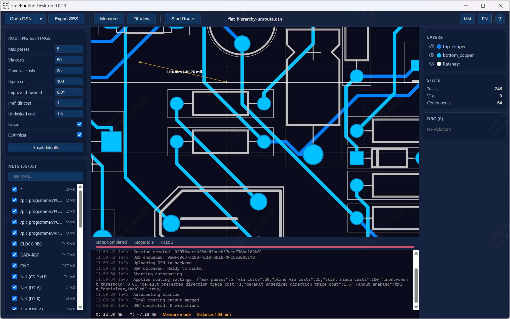

# FreeRouting Desktop

Modern desktop GUI for [FreeRouting](https://github.com/freerouting/freerouting), a PCB auto-router.

Replaces the old Swing GUI with a **Go + WebView** desktop app. The Go host detects whether FreeRouting is installed on the system, downloads and installs it if not, then launches it in API mode. The frontend (React + TypeScript + LeaferJS) renders the PCB board and communicates directly with the FreeRouting HTTP API through a CORS proxy.



## Download

You can download the file at [Release](https://github.com/easyeda2021/freerouting-desktop/releases)

## Features

- **LeaferJS PCB canvas** — visualize DSN and live SES routing output with layer visibility, ratsnest (airwire) display, zoom/pan, and object selection.
- **Native Windows file dialogs** — open/save dialogs powered by COMDLG32 (macOS and Linux use native dialogs via AppleScript / Zenity / KDialog).
- **Canvas measurement tool** — measure distances on the board with readout in mm or mil.
- **Unit & language switching** — toggle between mm/mil and English/中文 from the toolbar.
- **Layer list** — per-layer visibility toggles with eye icons and customizable colors.
- **Drag-and-drop DSN opening** — drop a `.dsn` file onto the canvas to load it.
- **Empty-state prompt** — canvas shows an open-file prompt when no board is loaded.
- **About dialog** — version, description, feature list, repository link, and author.
- **Recent files** — recently opened DSN files persisted in `localStorage`.
- **Clean Windows startup** — hidden parent window eliminates the startup flash; per-monitor DPI awareness keeps rendering sharp on high-DPI displays.

## Architecture

```
Go Host (WebView + FR Installer + CORS Proxy)
  └── WebView Window
       └── React Frontend (LeaferJS PCB Renderer + SES Parser)
            ↓ fetch/SSE via CORS proxy (:9080)
       FreeRouting Process (API Mode :37864, self-contained JRE)
```

- **Go host** (~5-10MB): WebView window, FR detection/download/install/process management, CORS proxy, native file dialogs
- **Frontend** (~0.5MB gzipped): React + TypeScript + LeaferJS for PCB canvas rendering, JS SES parser
- **No Rust, no Java, no Node.js runtime bundled** — single Go binary + static HTML/JS

## Platform Support

FreeRouting Desktop runs on the platform's built-in WebView engine:

| Platform | WebView Engine |
|----------|---------------|
| Windows | Edge WebView2 |
| macOS | Cocoa WKWebView |
| Linux | GTK + WebKitGTK |

The app itself is shipped as a single executable (`freerouting-desktop.exe` on Windows). When FreeRouting is not already installed, the Go host downloads the platform-specific FreeRouting package (`.msi`/`.zip` on Windows, `.dmg` on macOS, `.zip` on Linux) from GitHub Releases. FreeRouting packages bundle their own JRE — users never need to install Java.

## Development

### Prerequisites

- [Go](https://go.dev/dl/) 1.21+
- [Node.js](https://nodejs.org/) 18+
- [Make](https://www.gnu.org/software/make/). On Windows with MSYS2 install it with `pacman -S make`; the executable is in `C:\msys64\usr\bin`, **not** `C:\msys64\mingw64\bin`.
- C compiler (MinGW-w64 on Windows, Xcode CLI on macOS, GCC on Linux)
- [go-winres](https://github.com/tc-hib/go-winres) (`go install github.com/tc-hib/go-winres@latest`) — required for Windows icon/version resources

### Setup

```bash
git clone git@github.com:easyeda2021/freerouting-desktop.git
cd freerouting-desktop

# Frontend
cd frontend
npm install
npm run dev          # → localhost:1420

# Go host (separate terminal)
cd backend && go run .   # opens WebView loading localhost:1420
```

### Build

The project uses a Makefile to build the frontend, embed it into the Go binary, generate Windows resources (icon/version info), and compile the final executable.

```bash
# Windows (requires MinGW-w64 in PATH)
make windows

# macOS
make macos

# Linux
make linux
```

The Windows executable is written to `build/freerouting-desktop-<version>-windows-x64.exe`.

**Note on Windows toolchains:** `webview_go` requires CGO. Make sure MinGW-w64 is installed and its `bin` directory is on your PATH, then build with the compiler discoverable as `gcc`.

On Windows with MSYS2 you also need to install `make` (`pacman -S make`) and put both `usr\bin` (for `make`) and `mingw64\bin` (for `gcc`) on PATH:

```powershell
$env:PATH = "C:\msys64\mingw64\bin;C:\msys64\usr\bin;" + $env:PATH
$env:CC = "gcc"
make windows
```

#### Manual build without Make

If `make` is unavailable, run the equivalent steps manually (PowerShell example):

```powershell
$env:PATH = "C:\msys64\mingw64\bin;" + $env:PATH
$env:CC = "gcc"

# 1. Build frontend
cd frontend
npm run build
cd ..

# 2. Copy dist into backend for Go embed
Remove-Item -Recurse -Force backend/dist
Copy-Item -Recurse frontend/dist backend/dist

# 3. Generate Windows icon/version resources (requires go-winres)
python3 scripts/gen-res.py

# 4. Build Windows binary
cd backend
go build -ldflags="-s -w -H windowsgui -X main.version=$(Get-Content ..\VERSION) -X main.platform=windows" -o "../build/freerouting-desktop-$(Get-Content ..\VERSION)-windows-x64.exe" .
```

#### Simplified / no-icon build

If you only need a runnable binary without icons or Windows version metadata, you can build directly after `cd frontend && npm run build`:

```bash
cd backend
# On Windows with MinGW in PATH
go build -ldflags="-s -w -H windowsgui" -o freerouting-desktop.exe .
```

Cross-compilation is limited because `webview_go` depends on CGO and platform-specific WebView libraries; building for Windows must be done on Windows (or with a matching MinGW toolchain).

## How It Works

1. App starts → Go host detects if FreeRouting is installed on the system
2. If not installed → downloads the platform-specific package from GitHub Releases
3. Launches FreeRouting in API mode with `--gui.enabled=false`
4. Frontend opens DSN file → sends to FR API via CORS proxy → starts routing
5. FR pushes progress via SSE → frontend parses SES output → LeaferJS renders PCB board in real-time
6. User exports completed SES file

## License

MIT
